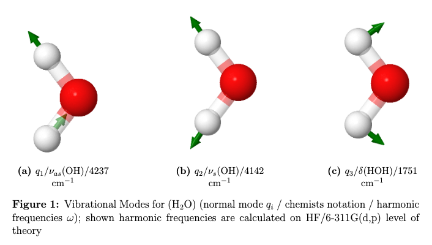

<script>
MathJax = {
  tex: {
    inlineMath: [['$', '$'], ['\\(', '\\)']]
  }
};
</script>
<script src="https://cdn.jsdelivr.net/npm/mathjax@3/es5/tex-chtml.js"></script>

## Frequenzberechnung

Die Änderung der potentiellen Energie $V$ der Kerne kann durch eine Taylor-Reihe um Entwicklungspunkt $X_0$ ausgedrückt werden:

$$V(X) = V(X_0) + g^T(X-X_0) + \frac{1}{2}(X-X_0)^T H (X-X_0) + ... $$

wobei wiederum $g$ der Gradient und $H$ die Hesse-Matrix ist. Die **harmonische Näherung** vereinfacht diese Taylor-Reihe indem nur die Terme bis zur zweiten Ableitung berücksichtigt werden. Im Energie-Minimum ist der Gradient $g^T=0$ und mit der Wahl $V(X_0)=0$ ergibt sich:

$$V(X) = \frac{1}{2}(X-X_0)^T H (X-X_0)$$

Die Elemente der Hesse-Matrix sind die zweiten Ableitungen der potentiellen Energie nach den Kernpositionen durch Diagonalisierung (Ähnlichkeitstransformation) wechselt man in das Koordinatensystem der **Normalmoden** und die Hesse-Matrix wird zur Diagonalmatrix $\Lambda$. Die Beiträge einzelner Atomkerne gehen hierbei massegewichtet in die Hesse-Matrix ein. Die Eigenwerte $\lambda_i$ entsprechen den Kraftkonstanten und können in Schwingungsfrequenzen $\nu_i$ umgerechnet werden:

$$\nu_i = \frac{1}{2\pi} \sqrt{\frac{\lambda_i}{\mu}}$$

Wird diese harmonische Näherung korrekt auf eine Minimums-Geometrie angewandt so sind alle Eigenwerte reell und positiv. 

> Falls ein Sattelpunkt vorliegt sind einige Eigenwerte negativ und die entsprechenden Frequenzen imaginär.

Folgende Abbildung zeigt die ersten drei Normalmoden des Wassermoleküls welche der antisymmetrischen- und symmetrischen Streckschwingung sowie der Biegeschwingung entsrpechen



### Frequenzberechnung in Orca

Folgender Input-File ist ein Beispiel für eine Frequenzberechnung in Orca. Als Methode wird wiederum Hartree Fock mit dem 6-311G(d,p) Basissatz verwendet. 

```text
 !HF 6-311G(d,p) OPT FREQ
 * xyz 0 1
       H      0.000000000    1.415075762    0.956290882
       O      0.000000000    0.000000000   -0.120510070
       H      0.000000000   -1.415075762    0.956290882
 *
```
Es wird sowohl eine Geometrie-Optimierung (OPT) als auch eine Frequenzberechnung (FREQ) durchgeführt. Grundsätzlich man diese Berechnung analytisch (wenn verfügbar) oder numerisch (durch zb Finite-Differenzen) durchführen. 

```text
-----------------------
VIBRATIONAL FREQUENCIES
-----------------------

Scaling factor for frequencies =  1.000000000  (already applied!)

     0:       0.00 cm**-1
     1:       0.00 cm**-1
     2:       0.00 cm**-1
     3:       0.00 cm**-1
     4:       0.00 cm**-1
     5:       0.00 cm**-1
     6:    1750.79 cm**-1
     7:    4141.74 cm**-1
     8:    4237.00 cm**-1


------------
NORMAL MODES
------------

These modes are the Cartesian displacements weighted by the diagonal matrix
M(i,i)=1/sqrt(m[i]) where m[i] is the mass of the displaced atom
Thus, these vectors are normalized but *not* orthogonal

                  0          1          2          3          4          5    
      0       0.000000   0.000000   0.000000   0.000000   0.000000   0.000000
      1       0.000000   0.000000   0.000000   0.000000   0.000000   0.000000
      2       0.000000   0.000000   0.000000   0.000000   0.000000   0.000000
      3       0.000000   0.000000   0.000000   0.000000   0.000000   0.000000
      4       0.000000   0.000000   0.000000   0.000000   0.000000   0.000000
      5       0.000000   0.000000   0.000000   0.000000   0.000000   0.000000
      6       0.000000   0.000000   0.000000   0.000000   0.000000   0.000000
      7       0.000000   0.000000   0.000000   0.000000   0.000000   0.000000
      8       0.000000   0.000000   0.000000   0.000000   0.000000   0.000000
                  6          7          8    
      0      -0.000000  -0.000000  -0.000000
      1      -0.430096  -0.583118  -0.561293
      2       0.559049  -0.398411  -0.427118
      3       0.000000   0.000000   0.000000
      4      -0.000000   0.000001   0.070729
      5      -0.070445   0.050202  -0.000001
      6      -0.000000   0.000000   0.000000
      7       0.430096   0.583097  -0.561316
      8       0.559049  -0.398396   0.427133
```
Im Output-File findet man dann die berechneten Frequenzen in cm$^{-1}$ und die zugehörigen massegewichteten Normalmoden.

### Anharmonische Frequenzberechnung mit VPT2 

Vibrational pertubation theroy (VPT) ist eine möglichkeit um die harmonische Beschreibung von molekularen Schwingungen zu verbessern. Ein quartisches Kraftfeld in Normalkoordinaten beschreibt hier harmonische und anharmonische Effekte

$$V = \frac{1}{2} \sum \lambda_i Q_i² + \frac{1}{6} \sum F_{ijk} Q_i Q_j Q_k + \frac{1}{24} \sum F_{ijkl} Q_i Q_j Q_k Q_l $$

hierbei sind $F_{ijk}$ und $F_{ijkl}$ die kubischen und quartischen Ableitungen des Potentials mit der Form:

$$F_{ijk} = \frac{\partial^3 V}{\partial Q_i \partial Q_j \partial Q_k}$$

$$F_{ijkl} = \frac{\partial^4 V}{\partial Q_i \partial Q_j \partial Q_k \partial Q_l}$$

Man schreibt den Hamiltonian dann als Summe:

$$H = H^{(0)} + H^{(1)} + H^{(2)}$$

wo jeweils die kubischen Terme in $H^{(1)}$ und die quartischen Terme in $H^{(2)}$ enthalten sind. 