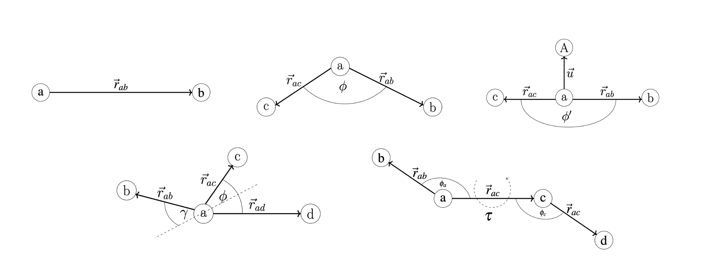
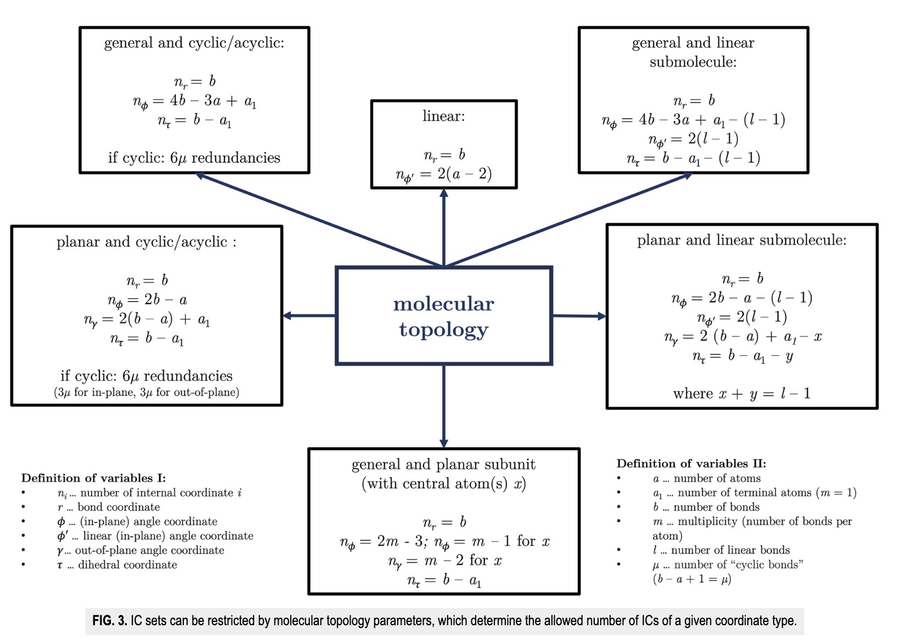
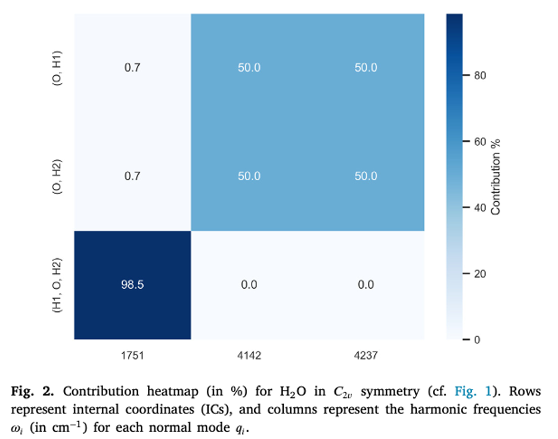

## Nomodeco - Normalmodenzerlegung

Das Standardverfahren zur quantenmechanischen Berechnung von Schwingungsfrequenzen basiert auf der **harmonischen Näherung**. Hierbei wird die Potentialfläche um die Minimumsgeometrie durch eine Taylor-Reihe bis zur zweiten Ableitung approximiert. Durch das Diagonalisieren der massengewichteten Hesse-Matrix erhält man die **Normalmoden** und die entsprechenden **Schwingungsfrequenzen**.

Für viele fortgeschrittene Anwendungen, z.b der anharmonischen Frequenzberechnung oder der Berechnung von multidimensionalen Potentialhyperflächen zeigen diese Normalmoden jedoch einige Einschränkungen:

+ Durch die harmonische Näherung ist die akkurate Beschreibung von **Schwingungsmoden nur in der Nähe des Minimums möglich**
+ Die Normalmoden sind **gekoppelt** und **delokalisiert** dies erschwert sowohl die Interpretation als auch Formulierung des zugehörigen Hamiltonoperators.

Wir verwenden in diesem Teil des Praktikums die Software `Nomodeco` welche durch einen Algorithmus optimale interne Koordinaten für ein gegebenes Molekül konstruiert. Diese sind **optimal** im Sinne von maximaler Entkopplung der Schwingungsmoden und des zugehörigen Vibrationsraums.

### Primitive Interne Koordinaten

> Primitive Interne Koordinaten (ICs) sind geometrische Parameter wie Änderungen in Bindungslängen, Bindungswinkel und Diederwinkel. Diese sind direkt mit der Molekülgeometrie verbunden und können über die kartesischen Koordinaten der Atomkerne berechnet werden.

Die folgende Abbildung zeig die verschiedenen internen Koordinaten welche in `Nomodeco` implementiert sind.

+ **Bonds:** Änderung der Bindungslänge $\vec{r}_{ab}$ 
+ **In-plane angles:** Änderung des Bindungswinkel $\phi$
+ **Linear angles:** Spezielle Winkelkoordinate für lineare Moleküle (zb $\text{CO}_2$) $\phi'$
+ **Dihedrals:** Änderung im Diederwinkel $\tau$
+ **Out-of-plane angles:** Änderung im Winkel der durch drei koplanare Atome definiert wird $\gamma$

### Beispiel: Elemente der $\mathbf{B}$ Matrix für die Bindungslänge $\vec{r}_{ab}$:

In kartesischen Koordinaten ist die Distanz vektorielle Differenz der Positionen der Atome $a$ und $b$:

$$\vec{r}_{ab} = (x_b - x_a) \vec{e}_x + (y_b - y_a) \vec{e}_y + (z_b - z_a) \vec{e}_z$$

Die Länge ergibt sich als Betrag des Distanzvektors:

$$|\vec{r}_{ab}|^2 = (x_b - x_a)^2 + (y_b - y_a)^2 + (z_b - z_a)^2$$

Das Differential der Bindungslänge ergibt sich durch die Kettenregel:

$$|\vec{r}_{ab}|\Delta r_{ab} = (x_b - x_a)(\Delta x_b - \Delta x_a) + (y_b - y_a)(\Delta y_b - \Delta y_a) + (z_b - z_a)(\Delta z_b - \Delta z_a)$$

Man erhält für jeden kartesischen Basisvektor zwei Elemente der $\mathbf{B}$ Matrix:

$$B_{xa} = -A_{ab} \quad B_{ya} = -B_{ab} \quad B_{za} = -C_{ab}$$

$$B_{xb} = A_{ab} \quad B_{yb} = B_{ab} \quad B_{zb} = C_{ab}$$

wobei hier

$$A_{ab} = \frac{1}{|\vec{r}_{ab}|}(x_b - x_a) \quad B_{ab} = \frac{1}{|\vec{r}_{ab}|}(y_b - y_a) \quad C_{ab} = \frac{1}{|\vec{r}_{ab}|}(z_b - z_a)$$

## Transformation zu Internen Koordinaten

Ein Molekül mit $N$ Atomen hat $3N$ kartesische und $S = 3N-6(5)$ interne Koordinaten $\vec{R}$. 

$$\vec{X} = (x_1,y_1,z_1,...,x_N,y_N,z_N)^T$$

$$\vec{R} = (r_1,...,r_S)^T$$

Die Transformation von **kartesischen** in **interne Koordinaten** erfolgt über die **Wilson B-Matrix**:

$$\vec{R} = \mathbf{B} \cdot \vec{X}$$

Die potentielle Energie eines Moleküls ergibt sich aus den Kraftkonstanten, welche die zweiten Ableitungen der potentiellen Energie nach den jeweiligen Koordinatern sind.

$$f_{ij} = \frac{\partial^2 E}{\partial x_i \partial x_j}$$

$$F_{ij} = \frac{\partial^2 E}{\partial r_i \partial r_j}$$

Mittels der Matrix $\mathbf{B}$ können die Kraftkonstanten in kartesischen Koordinaten in die Kraftkonstanten in internen Koordinaten transformiert werden:

$$\mathbf{F} = (\tilde{\mathbf{B}}^{-1})^T \cdot \mathbf{f} \cdot \tilde{\mathbf{B}}^{-1}$$

$$\mathbf{f} = \tilde{\mathbf{B}}^T \cdot \mathbf{F} \cdot \tilde{\mathbf{B}}$$

Die Matrix $\tilde{\mathbf{B}}$ enspricht einer modifizierten $\mathbf{B}$ Matrix wo  zusätzliche Nullzeilen für die translativen und rotativen Freiheitsgrade hinzufügt wurden.

Ausgehend von den massengewichteten Kraftkonstanten in kartesischen Koordinaten kann man eine Darstellung von Normalmoden in internen Koordinaten erhalten:

1. $\mathbf{f'} = (\mathbf{M}^{-1/2})^T \cdot \mathbf{f} \cdot \mathbf{M}^{-1/2}$
2. Die Diagonalisiert man zu $\Lambda = \mathbf{L}^T \cdot \mathbf{f'} \cdot \mathbf{L}$
3. Die $\mathbf{L}$ Matrix enthält also die Normalmoden in kartesischen Koordinaten.
4. Man definiert $\mathbf{l} = \mathbf{M}^{-1/2} \cdot \mathbf{L}$
5. Dann verwendet man die $\mathbf{B}$ Matrix für folgende Transformation: $\Lambda = \mathbf{l}^T \cdot \mathbf{l} = \mathbf{l}^T \cdot (\mathbf{B}^T \cdot \mathbf{F} \cdot \mathbf{B}) \cdot \mathbf{l}$
6. Die Darstellung $\mathbf{D} = \mathbf{B} \cdot \mathbf{l}$ gibt uns also eine Darstellung der massengewichteten Normalmoden in internen Koordinaten.

## Molekulare Topologie

Ein weiterer wichtiger Aspekt von `Nomodeco`ist die Reduktion der möglichen Anzahl der internen Koordinaten durch die Berücksichtigung der molekularen Topologie. Eine Reihe an mathematischer Beziehung gibt uns hier automatisch die Anzahl der möglichen primitiven internen Koordinaten für ein gegebenes Molekül vor

## Wie interpretiert man eine Contribution Table?

Die folgende Abbildung zeigt die Contribution Table für die Schwingungsmoden eines Wassermoleküls. Auf der $x$-Achse sind die harmonischen Frequenzen der Normalmoden in $\text{cm}^{-1}$ aufgetragen. Auf der $y$-Achse sieht man als Tupel das vom Programm selektierte **optimale interne Koordinatenset** für die Darstellung der Normalmoden. Die Werte in der Heatmap gibt den prozentuellen Beitrag der jeweiligen internen Koordinate zur beschreibung der Schwingungsbewegung der Normalmode an.

Wir können aus dieser Tabelle folgende Informationen entnehmen:

1. Die Notation der Normalmode kann abgeleitet werden: z.b bei 1751 $\text{cm}^{-1}$ handelt es sich um die Biegeschwingung $\delta_{ip}$ da die in-plane Winkelkoordinate $\phi$ (H1,O,H2) den höchsten Beitrag von 98.5\% hat.
2. Man kann zudem stark delokalisierte Schwingungsmoden identifizieren: diese weisen beispielsweise mehrere kleine Beiträge von verschiedenen internen Koordinaten auf.

### Aufgaben:

+ Verwende `Nomodeco`um die Normalmodenzerlegung auf ein Molekül deiner Reaktion durchzuführen. Wie viele interne Koordinaten wurden generiert? Welches Set wurde dann ausgewählt? Wie hilft dir die Contribution Table bei der physikalischen Interpretation der Schwingungsmoden?
+ Leite dir aus der Contribution Table und mittels einer Internetrecherche die Notation der jeweiligen Schwingungen ab. Welche Schwingungsmoden kannst du idenfizieren? In welchen Frequenzbereichen liegen diese?
+ Siehst du einen Effekt der Geometrie und Symmetrie des Moleküls in der Contribution Table?
+ Wenn dein Molekül H-Atome enthält, kannst du auch eine Deuterierung durchführen. Wie ändert sich die Contribution Table? Wie ändern sich die Schwingungsfrequenzen?

