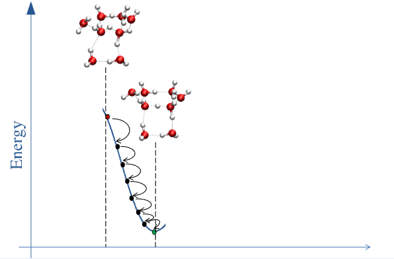

<script>
MathJax = {
  tex: {
    inlineMath: [['$', '$'], ['\\(', '\\)']]
  }
};
</script>
<script src="https://cdn.jsdelivr.net/npm/mathjax@3/es5/tex-chtml.js"></script>


## Optimierung der Molekülgeometrie

Eine dreidimensionale Anordnung von Atomen im Raum ist eine __Molekülgeometrie__. Die __Minimumsgeometrie__ ist jene Anordnung bei der die potentielle Energie des Moleküls minimal ist. Für viele quantenchemische Berechnungen ist das Auffinden einer Minimumsgeometrie oft der erste Schritt. Dies wird als __Geometrieoptimierung__ bezeichnet.

Folgende Abbildung (erstellt von Prof. Thomas Hofer) zeigt schematisch eine Geometrieoptimierung. Beginnend von einer Startgeometrie soll die relative Anordnung der Atomkerne zueinander gefunden werden, sodass die Gesamtenergie des Moleküls minimal ist. In dieser Anordnung sind die Kräfte die auf die Atomkerne wirken gleich Null.



> **Note:** Jede Anordnung der Kerne entspricht einem Punkt auf der __Potential-Hyperfläche__ (engl. Potential Energy Surface, PES). Diese Fläche beschreibt die potentielle Energie des Moleküls in Abhängigkeit der Kernpositionen. Eine Geometrieoptimierung sucht den nächstgelegenen Tiefpunkt auf dieser Fläche.

Die Potentialhyperfläche ist unbekannt kann jedoch mathematisch als __Taylor-Reihe__ approximiert werden:

$$ E(x) = E(x_0) + g_0^T \Delta x + \frac{1}{2} \Delta x^T H_0 \Delta x + ... $$

+ $g_0^T$ ist der Gradient und entspricht der ersten Ableitung der Energie nach den Kernpositionen. Im Minimum ist dieser Vektor gleich Null.
+ $H_0$ ist die Hesse-Matrix und entspricht der zweiten Ableitung der Energie nach den Kernpositionen. Diese Matrix beschreibt die Krümmung der Potential-Hyperfläche

### Geometrie-Optimierung in Orca

Folgender Input-File ist ein Beispiel für eine Geometrieoptimierung in Orca. 

```text
! HF 6-311G(d,p) OPT
* xyz 0 1
 O  0.000000  0.000000  0.000000
  H  0.758602  0.000000  0.504284
  H  0.758602  0.000000  -0.504284
*
```  

Die erste Zeile beginnend mit dem `!` Symbol enthält hier die Anweisungen für Orca:

+ **HF:** Verwendung der Hartree-Fock Methode
+ **6-311G(d,p):** Spezifikation des Basissatzes
+ **OPT:** Keyword für die Geometrieoptimierung

Die Zeilen mit dem *xyz beschreiben die Geometrie des Moleküls in Räumlichen Koordinaten. Die 0 und 1 geben die Gesamtladung und Multiplizität des Moleküls an.

#### Ein Blick in den Output-File

Im Output-File wird folgender Block angezeigt sobald die Geometrie-Optimierung beginnt:

```text

                       *****************************
                       * Geometry Optimization Run *
                       *****************************

Geometry optimization settings:
Update method            Update   .... BFGS
Choice of coordinates    CoordSys .... (2022) Redundant Internals
Initial Hessian          InHess   .... Almloef's Model
Max. no of cycles        MaxIter  .... 50

Convergence Tolerances:
Energy Change            TolE     ....  5.0000e-06 Eh
Max. Gradient            TolMAXG  ....  3.0000e-04 Eh/bohr
RMS Gradient             TolRMSG  ....  1.0000e-04 Eh/bohr
Max. Displacement        TolMAXD  ....  4.0000e-03 bohr
RMS Displacement         TolRMSD  ....  2.0000e-03 bohr
Strict Convergence                .... False
``` 

Dieser Block zeigt sowohl die Optimierungsmethode (BFGS) als auch die Wahl der Koordinaten (Redundant Internals) und einige Parameter für die Konvergenz des Verfahrens.


```text  

                                .--------------------.
          ----------------------|Geometry convergence|-------------------------
          Item                value                   Tolerance       Converged
          ---------------------------------------------------------------------
          RMS gradient        0.1118954640            0.0001000000      NO
          MAX gradient        0.1618216140            0.0003000000      NO
          RMS step            0.1732050808            0.0020000000      NO
          MAX step            0.2739217962            0.0040000000      NO
          -------------------------------------------------------------------------
          ........................................................
          Max(Bonds)      0.0458      Max(Angles)   15.69
          Max(Dihed)        0.00      Max(Improp)    0.00
          ---------------------------------------------------------------------

The optimization has not yet converged - more geometry cycles are needed
``` 
Nach den jeweiligen SCF-Runs wird dann ein Block angezeigt welcher die aktuelle Konvergenz des Verfahrens beschreibt. Dieser zeigt beispielsweise die aktuelle Step-Length sowie den Gradienten und die Toleranzparameter welche in der Anfangsphase meist nicht erfüllt sind. 


```text

                                .--------------------.
          ----------------------|Geometry convergence|-------------------------
          Item                value                   Tolerance       Converged
          ---------------------------------------------------------------------
          Energy change      -0.0000268592            0.0000050000      NO
          RMS gradient        0.0002059687            0.0001000000      NO
          MAX gradient        0.0002093130            0.0003000000      YES
          RMS step            0.0006471653            0.0020000000      YES
          MAX step            0.0010850366            0.0040000000      YES
          -------------------------------------------------------------------------
          ........................................................
          Max(Bonds)      0.0001      Max(Angles)    0.06
          Max(Dihed)        0.00      Max(Improp)    0.00
          ---------------------------------------------------------------------

       The step convergence is overachieved with 
       reasonable convergence on the gradient
       Convergence will therefore be signaled now


                    ***********************HURRAY********************
                    ***        THE OPTIMIZATION HAS CONVERGED     ***
                    *************************************************
```

Sobald die Optimierungskriterien erfüllt sind wird dieser Block im Output-File angezeigt. Man erhält somit eine Minimumsgeometrie welche man für weitere Berechnungen verwenden kann.
### Aufgabe 1
Berechnen Sie optimierte Strukturen für die Moleküle der Ihnen zugewiesenen Reaktion auf den nachfolgenden Levels of Theory:

  - HF/6-311G(d,p)
  - B3LYP/6-311G(d,p)
  - MP2/6-311G(d,p)

Vergleichen Sie im Anschluss die internen Koordinaten Ihrer Moleküle mit experimentellen Daten. Stellen Sie sich die Frage ob dieser Vergleich notwendig ist oder ob eine ähnliche Aussage bereits früher anhand der berechneten Energien getroffen werden kann?
### Verständnisfragen

- Was bestimmt das Ende einer Geometrieoptimierung?
- Welche Rolle spielt der Gradient in einer Geometrieoptimierung?
- Wie könnte ich sehen ob eine Geometrieoptimierung ein Minimum gefunden hat (Stichwort: Frequenzberechnung)?
- Was ist die Hesse-Matrix und welche Information enthält diese?
- Wie ist der 6-311G(d,p) Basissatz zu interpretieren? Wie viele AOs erwarten Sie sich für Ihre einzelnen Reaktanden bei der Verwendung dieses Basissatzes? Tipp: Versuchen Sie es selbst auszurechnen und mit dem ORCA-Output abzugleichen.
- Woher kommen hochgenaue experimentelle Geometriedaten von kleinen Molekülen.


