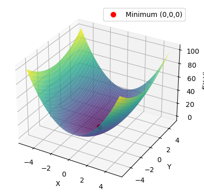

<script>
MathJax = {
  tex: {
    inlineMath: [['$', '$'], ['\\(', '\\)']]
  }
};
</script>
<script src="https://cdn.jsdelivr.net/npm/mathjax@3/es5/tex-chtml.js"></script>


## Potentialhyperfläche

Wie bereits in der Aufgabe zur Frequenzberechnung beschrieben entspricht jede geometrische Anordnung eines Moleküls mit Kernkoordinaten $R$ einen Punkt auf einer Potentialhyperfläche $V(R)$

$$V(R) = \sum_{A=1}^N \sum_{B>A}^N \frac{Z_A Z_B}{|R_A - R_B|} + E_{el}(R)$$

Diese potentielle Energie $V(R)$ besteht aus der Wechselwirkung der Kerne untereinander und aus der Wechselwirkung mit den Elektronen $E_{el}(R)$, welche durch die elektronische Schrödingergleichung bestimmt wird. Für ein Molekül mit $N$ Kernen ist diese Potentialhyperfläche eine Funktion in einem $3N$-dimensionalen Raum. Da jedoch Translation und Rotation invariant in Bezug auf die potentielle Energie sind, reduziert sich die Anzahl der Freiheitsgrade um 6 (bzw. 5 für lineare Moleküle). Somit hat ein Molekül mit $N$ Atomen $3N-6$ innere Freiheitsgrade die die Form der Potentialhyperfläche bestimmen. In der folgenden Abbildung ist eine schematische Darstellung einer solchen Hyperfläche ersichtlich.


Chemisch interessant sind Punkte an welchen die erste Ableitung der potentiellen Energie für jede beliebige Kernkoordinate $R_A$ null ist (Gradient). Diese Punkte werden allgemein als stationäre Punkte bezeichnet und können Minima, Sattelpunkte oder Maxima sein. Die Klassifikation dieser stationären Punkte erfolgt über die Matrix der zweiten Ableitungen der potentiellen Energie, die sogenannte Hesse-Matrix $H$ mit den Elementen:

$$H_{ij} = \frac{\partial^2 V}{\partial R_i \partial R_j}$$

+ Ist die Hesse-Matrix positiv definit, so handelt es sich um ein Minimum (alle Eigenwerte sind positiv).
+ Ist die Hesse-Matrix negativ definit, so handelt es sich um ein Maximum (alle Eigenwerte sind negativ).
+ Hat die Hesse-Matrix sowohl positive als auch negative Eigenwerte, so handelt es sich um einen Sattelpunkt.

In der folgenden Aufgabe wird also die Potentialhyperfläche in einer Dimension untersucht.

## Bindungsscan in Orca

In Orca ist es möglich durch den Relaxed Surface Scan eine Koordinate zu varrieren während alle anderen Koordinaten relaxiert bleiben. Der folgende Inputfile zeigt ein Beispiel für einen solchen Scan entlang der O-O Bindung in einem $O_2$ Molekül:

```text
! MP2 6-311G(d,p) OPT
%PAL NPROCS 6 END


%geom Scan
	B 0 1 =2.224, 0.7240, 150
	end
end
* xyz 0 3
  O                  2.84867661    1.15827336    0.03729123
  O                  1.68707661    1.15827336    0.03729123
*
```

Es wird also die $MP2$ Methode mit einen 6-311G(d,p) Basisatz verwendet. Man gibt das Keyword `OPT` an und variiert dann im Optionsblock `%geom Scan` die Bindungslänge zwischen Atom 0 und Atom 1 von $2.224\,\text{\AA}$ bis $0.7240\,\text{\AA}$ in 150 Schritten. Man erhält nun in jedem Schritt einen `.xyz` File der jeweiligen Struktur (welcher auch den Wert für die Energie enthält). Im Output-FIle findet man am Ende zusammenfassend die Ergebnisse dieses Scans.

```text
----------------------------
RELAXED SURFACE SCAN RESULTS
---------------------------
The Calculated Surface using the MP2 energy
   2.22400000 -149.99109371
   2.21393289 -149.98889872
   2.20386577 -149.98675952
   2.19379866 -149.79916915
   2.18373154 -149.79921771
   2.17366443 -149.79926904
   2.16359732 -149.79932267
    ...
``` 

Für die weitere Analyse kann man den `.relaxedscan(methode).dat` File verwenden, welcher in der ersten Spalte die varrierte Koordinate und in der zweiten Spalte die potentielle Energie enthält.

### Beispiel zur Klassifikation stationärer Punkte

Wir betrachten im folgenden die Funktion $f(x,y) = 3x^2 + y^2$. Diese ist eine Funktion mit zwei Variablen und man kann sich die Frage nach möglichen stationären Punkten stellen. Dazu berechnen wir zuerst den Gradienten:

+ $\frac{\partial f}{\partial x} = 6x$
+ $\frac{\partial f}{\partial y} = 2y$

Durch Nullsetzen des Gradienten erhalten wir den einzigen stationären Punkt bei $(x,y) = (0,0)$. Um die Natur dieses stationären Punktes zu bestimmen, berechnen wir die Hesse-Matrix:

$$H_f(x,y)  = \begin{pmatrix}\frac{\partial^2 f}{\partial x^2} & \frac{\partial^2 f}{\partial x \partial y} \\\\ \frac{\partial^2 f}{\partial y \partial x} & \frac{\partial^2 f}{\partial y^2} \end{pmatrix} = \begin{pmatrix}6 & 0 \\\\ 0 & 2 \end{pmatrix}$$

Man sieht sofort das die einzigen Eigenwerte dieser Matrix $6$ und $2$ sind. Somit ist die Hesse-Matrix positiv definit und der stationäre Punkt bei $(0,0)$ ein Minimum.

Dieses Problem kann man auch sehr leicht in Python visualisieren:

```python
import numpy as np
import matplotlib.pyplot as plt

x = np.linspace(-5, 5, 100)
y = np.linspace(-5, 5, 100)
X, Y = np.meshgrid(x, y)
Z = 3*X**2 + Y**2

fig = plt.figure()
ax = fig.add_subplot(111, projection='3d')
ax.plot_surface(X, Y, Z, cmap='viridis', alpha=0.8)
ax.scatter(0, 0, 0, color='red', s=50, label='Minimum (0,0,0)')
ax.set_xlabel('X')
ax.set_ylabel('Y')
ax.set_zlabel('f(X,Y)')
ax.legend()
plt.show()
````

Dies gibt uns als Ergebnis die folgende Grafik:


### Aufgabe 3
Scannen Sie entlang einer Bindung in einem(!) ihrer Moleküle. Beachten Sie dabei das der Scan-Block so eingestellt werden muss, dass tatsächlich auch durch das Minimum gescannt wird. Zur Auswertung soll die harmonische Frequenz dieser "Pseudo-Schwingung" anhand eines Parabelfits bestimmt werden. Dabei kann die harmonische Kraftkonstante über folgenden Zusammenhang aus dem Fit bestimmt werden:

$V(r)= \frac{1}{2}k \cdot(r-r_0)²$

Diese kann im Anschluss in eine Schwingungsfrequenz in cm <sup>-1</sup> umgerechnet und mit experimentellen Daten sowie den harmonischen Frequenzen aus der Frequenzrechnung verglichen werden.

Für den Fit wird es im Laufe des Praktikums einen Code-along Tag geben, wo Ihnen das Fitten von Funktion an sich, wie auch die Verwendung von Python und Jupyter-Notebooks etwas näher gebracht wird.

Grundsätzlich können Sie den Fit aber durchführen wie Sie wollen (Excel, Origin, Python, Julia, R, etc...).

### Verständnisfragen

+ Was sind stationäre Punkte auf einer Potentialhyperfläche und wie können diese klassifiziert werden?
+ Wie kommt man von einer Potentialhyperfläche zu Schwingungsfrequenzen?
+ Was sind Sattelpunkte? Wie werden diese mathematisch definiert und welche Bedeutung haben diese in der Chemie?
