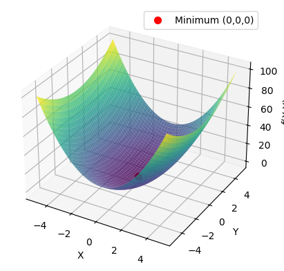

<script>
MathJax = {
  tex: {
    inlineMath: [['$', '$'], ['\\(', '\\)']]
  }
};
</script>
<script src="https://cdn.jsdelivr.net/npm/mathjax@3/es5/tex-chtml.js"></script>


## Potentialhyperfläche

Wie bereits in der Aufgabe zur Frequenzberechnung beschrieben entsprich jede geometrische Anordnung eines Moleküls mit Kernkoordinaten $R$ einen Punkt auf einer Potentialhyperfläche $V(R)$

$$V(R) = \sum_{A=1}^N \sum_{B>A}^N \frac{Z_A Z_B}{|R_A - R_B|} + E_{el}(R)$$

Diese potentielle Energie $V(R)$ besteht aus der Wechselwirkung der Kerne untereinander und aus der Wechselwirkung mit den Elektronen $E_{el}(R)$ die durch die elektronische Schrödingergleichung bestimmt wird. Für ein Molekül mit $N$ Kernen ist diese Potentialhyperfläche eine Funktion in einem $3N$-dimensionalen Raum. Da jedoch Translation und Rotation invariant in Bezug auf die potentielle Energie sind, reduziert sich die Anzahl der Freiheitsgrade um 6 (bzw. 5 für lineare Moleküle). Somit hat ein Molekül mit $N$ Atomen $3N-6$ innere Freiheitsgrade die die Form der Potentialhyperfläche bestimmen. In der folgenden Abbildung ist eine schematische Darstellung einer solchen Hyperfläche ersichtlich.


Chemisch interessant sind Punkte an welche die erste Abbleitung der potentiellen Energie für jede beliebige Kernkoordinate $R_A$ null (Gradient). Diese Punkte werden allgemein als stationäre Punkte bezeichnet und können Minima, Sattelpunkte oder Maxima sein. Die Klassifikation dieser stationären Punkte erfolgt über die Matrix der zweiten Ableitungen der potentiellen Energie, die sogenannte Hesse-Matrix $H$ mit den Elementen:

$$H_{ij} = \frac{\partial^2 V}{\partial R_i \partial R_j}$$

+ Ist die Hesse-Matrix positiv definit, so handelt es sich um ein Minimum (alle Eigenwerte sind positiv).
+ Ist die Hesse-Matrix negativ definit, so handelt es sich um ein Maximum (alle Eigenwerte sind negativ).
+ Hat die Hesse-Matrix sowohl positive als auch negative Eigenwerte, so handelt es sich um einen Sattelpunkt.

In der folgenden Aufgabe sollte man also die Potentielhyperfläche in einer Dimension untersuchen. Konkret machen wir einen Scan entlang einer Bindungslänge eines Moleküls. Für jeden Punkt dieses Scans wird also die elektronische Schrödingergleichung gelöst um die potentielle Energie zu bestimmen. Anschließend kann man durch einen harmonischen Fit an dieses Potential die Schwingunsfrequenz der korrenspondierenden Streckschwingung bestimmen.

## Bindungscan in Orca

In Orca ist es möglich durch den Relaxed Surface Scan eine Koordinate zu varrieren während alle anderen Koordinaten relaxiert bleiben. Der folgende Inputfile zeigt ein Beispiel für einen solchen Scan entlang der O-O Bindungslänge in einem $O_2$ Molekül:

```text
! MP2 6-311G(d,p) OPT
%PAL NPROCS 6 END


%geom Scan
	B 0 1 =2.224, 0.7240, 150
	end
end
* xyz 0 3
  O                  2.84867661    1.15827336    0.03729123
  O                  1.68707661    1.15827336    0.03729123
*
```

Es wird also die $MP2$ Methode mit einen 6-311G(d,p) Basisatz verwendet man gibt das Keyword `OPT` an und lässt dan im Optionsblock `%geom Scan` die Bindungslänge zwischen Atom 0 und Atom 1 von $2.224\,\text{\AA}$ bis $0.7240\,\text{\AA}$ in 150 Schritten variieren. Man erhält nun in jeden Schritt einen `.xyz` File der jeweiligen Struktur (welcher auch den Wert für die Energie enthält), im Output-FIle findet man am Ende zusammenfassend die Ergebnisse dieses Scans

```text
----------------------------
RELAXED SURFACE SCAN RESULTS
---------------------------
The Calculated Surface using the MP2 energy
   2.22400000 -149.99109371
   2.21393289 -149.98889872
   2.20386577 -149.98675952
   2.19379866 -149.79916915
   2.18373154 -149.79921771
   2.17366443 -149.79926904
   2.16359732 -149.79932267
    ...
``` 

Für die weitere Analyse kann man den `.relaxedscan(methode).dat` File verwenden welcher in der ersten Spalte die varrierte Koordinate und in der zweiten Spalte die potentielle Energie enthält.

### Beispiel zur Klassifikation stationärer Punkte

Wir betrachten im folgenden die Funktion $f(x,y) = 3x^2 + y^2$. Diese ist eine Funktion mit zwei Variablen und man kann sich also die Frage nach möglichen stationären Punkten stellen. Dazu berechnen wir zuerst den Gradienten:

+ $\frac{\partial f}{\partial x} = 6x$
+ $\frac{\partial f}{\partial y} = 2y$

Durch Nullsetzen des Gradienten erhalten wir den einzigen stationären Punkt bei $(x,y) = (0,0)$. Um die Natur dieses stationären Punktes zu bestimmen, berechnen wir die Hesse-Matrix:

$$H_f(x,y)  = \begin{pmatrix}\frac{\partial^2 f}{\partial x^2} & \frac{\partial^2 f}{\partial x \partial y} \\\\ \frac{\partial^2 f}{\partial y \partial x} & \frac{\partial^2 f}{\partial y^2} \end{pmatrix} = \begin{pmatrix}6 & 0 \\\\ 0 & 2 \end{pmatrix}$$

Man sieht sofort das die einzigen Eigenwerte dieser Matrix $6$ und $2$ sind somit ist die Hesse-Matrix positiv definit und der stationäre Punkt bei $(0,0)$ ein Minimum.

Dieses Problem kann man auch sehr leicht in Python visualisieren:

```python
import numpy as np
import matplotlib.pyplot as plt

x = np.linspace(-5, 5, 100)
y = np.linspace(-5, 5, 100)
X, Y = np.meshgrid(x, y)
Z = 3*X**2 + Y**2

fig = plt.figure()
ax = fig.add_subplot(111, projection='3d')
ax.plot_surface(X, Y, Z, cmap='viridis', alpha=0.8)
ax.scatter(0, 0, 0, color='red', s=50, label='Minimum (0,0,0)')
ax.set_xlabel('X')
ax.set_ylabel('Y')
ax.set_zlabel('f(X,Y)')
ax.legend()
plt.show()
````

Dies gibt uns als Ergebnis die folgende Grafik:



